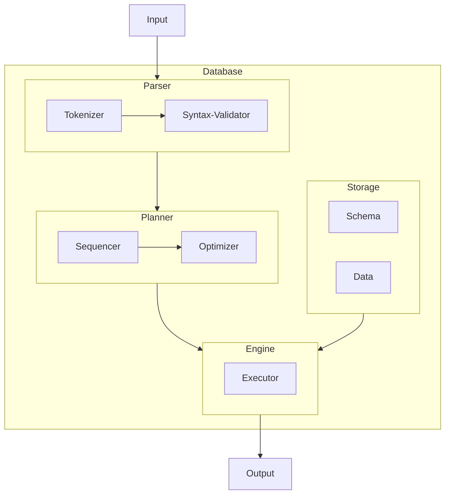

## Structure 

```mermaid
flowchart TD;

subgraph Database 
	Engine
	Parser
	Planner
	Storage
end

Input --> Parser

subgraph Parser
	Tokenizer --> Syntax-Validator
end

Parser --> Planner

subgraph Planner
	Sequencer --> Optimizer
end

Planner --> Engine

subgraph Engine
	Executor
end

Engine --> Output

subgraph Storage
	Schema
	Data
end

Storage --> Engine
```