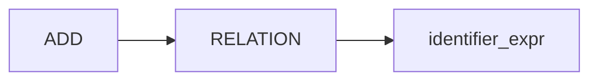
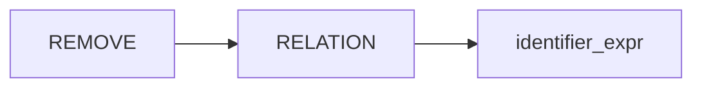
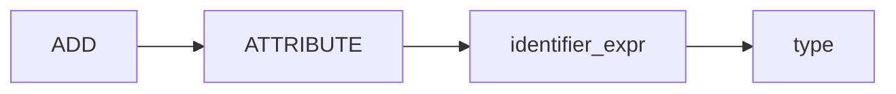
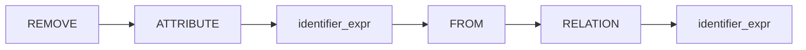
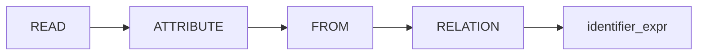
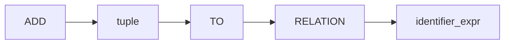

## Create a Relation


## Destroy a Relation


## Determine all Relations

```json
[
	["name"],
	["users"],
	["posts"],
]
```

## Add an Attribute to a Relation


## Remove an Attribute from a Relation


> **Self**: not sure about this syntax

## Determine all Attributes of a Relation

```json
[
	["name"    , "type"   , "unique", "nullable", "default"],
	["email"   , "string" , true    , false     , null     ],
	["id"      , "number" , true    , false     , null     ],
	["name"    , "string" , false   , true      , null     ],
	["verified", "boolean", false   , false     , false    ],
]
```

## Add Tuple to Relation

```
ADD { 
	id: 123, 
	email: "user@domain.tld", 
	name: "Riley Jones",
} TO RELATION users
````
